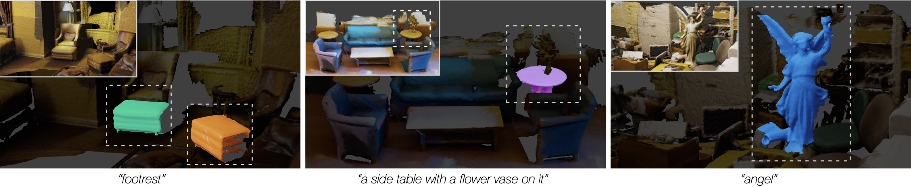

# OpenMask3D 🛋
## Open-Vocabulary 3D Instance Segmentation 

<a href="https://aycatakmaz.github.io/">Ay&#231;a Takmaz</a>*1,
<a href="https://elisabettafedele.github.io/">Elisabetta Fedele</a>*1,
 
<a href="https://people.inf.ethz.ch/~sumnerb/">Robert W. Sumner</a>1,
<a href="https://people.inf.ethz.ch/pomarc/">Marc Pollefeys</a>1,2,
<a href="https://federicotombari.github.io/">Federico Tombari</a>3,
<a href="https://francisengelmann.github.io/">Francis Engelmann</a>1,3

1ETH Zürich
2Microsoft
3Google
*equal contribution

<h2 class="title is-3">BibTeX</h2>
          <pre><code>
@inproceedings{takmaz2023openmask3d,
  title={{OpenMask3D: Open-Vocabulary 3D Instance Segmentation}},
  author={Takmaz, Ay{\c{c}}a and Fedele, Elisabetta and Sumner, Robert W. and Pollefeys, Marc and Tombari, Federico and Engelmann, Francis},
  booktitle={Advances in Neural Information Processing Systems (NeurIPS)},
year={2023}
}</code></pre>
    

  

